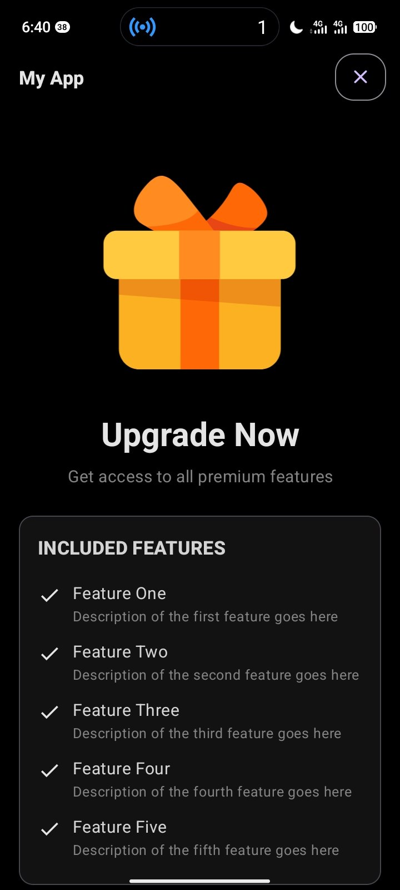
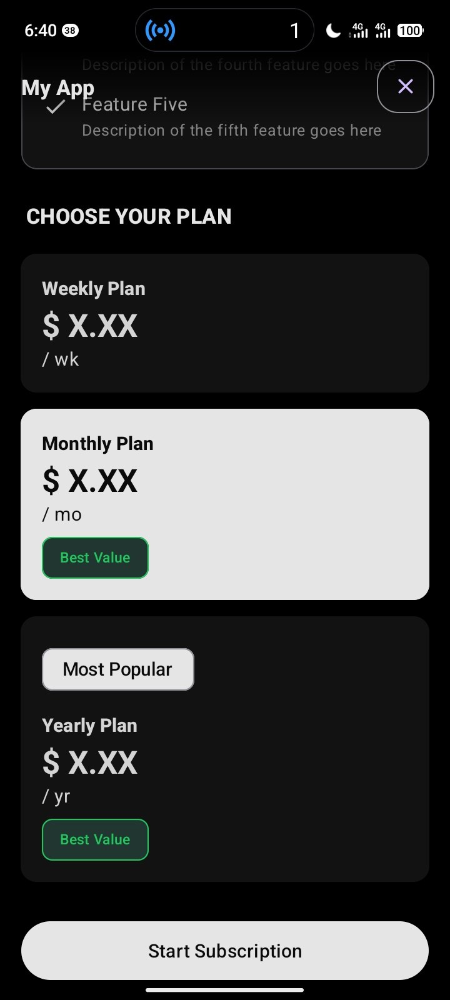
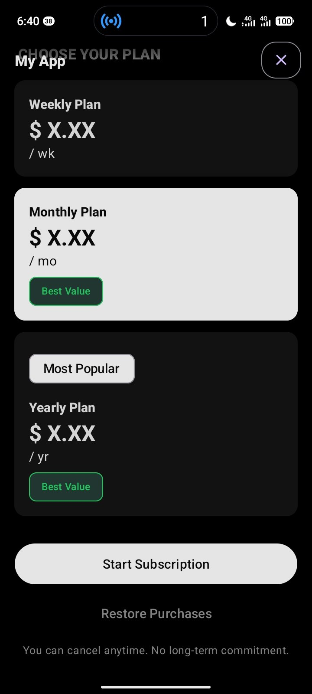

# BillingCompat

A Secure Google Play Billing Wrapper for Android

[](https://jitpack.io/#euptron/billing-compat)
[](LICENSE)
[](https://developer.android.com/studio/releases/platforms)
[](https://developer.android.com/google/play/billing/release-notes)

BillingCompat wraps [Google Play Billing](https://developer.android.com/google/play/billing/release-notes) Library 9.x with a clean builder API, multi-layered runtime security, and a server-side verification client ready to point at your own backend. Define your products, build the manager, launch a purchase — the parts that usually take a week of integration work are already done.

## Why BillingCompat?

[Google Play Billing](https://developer.android.com/google/play/billing/integrate) gives you the building blocks to enable you to sell digital products and content in your Android app, not a finished integration. Every app ends up rebuilding the same things: ownership tracking, refund handling, fraud detection, and server verification. Skip any part of it and your paywall is one bypass from negative **ROI**.

**BillingCompat** abstracts the complexity of integration into a structured, builder-based API. Define your products once. Configure your handlers once. Launch purchases, check ownership, manage balances, and verify transactions all through clean, readable code.

## Screenshots

<div align="center">
  
  
  
</div>

## Features

**Core Module**
- [x] Non-consumable, consumable, subscription, and pending purchase types
- [x] Builder-based setup and purchase flow (`BillingConfigBuilder`, `PurchaseBuilder`)
- [x] Subscription upgrades and downgrades with proration control
- [x] Configurable offer selection for base plans, trials, and promos
- [x] Per-product ownership and balance persistence synced against Google Play
- [x] Runtime threat detection — patchers, Frida, Xposed, debuggers, root, and emulators
- [x] APK signature verification to catch re-signed and cloned builds
- [x] Purchase fraud detection by comparing local cache against Google Play state
- [x] Async server-side verification client with timeout and fallback support
- [x] Auto-reconnect on billing service disconnect
- [x] Pending purchase lifecycle handling
- [x] Consumable balance tracking with atomic spend support
- [ ] Subscription pause and resume
- [ ] Installment plan support
- [ ] Family sharing detection

**UI Module (optional)**
- [x] Fullscreen paywall `DialogFragment`, zero billing logic
- [x] Hero image, feature list, and plan cards in one scrollable layout
- [x] Vertical and horizontal plan card orientation
- [x] Per-card discount badge and recommended badge
- [x] Light and dark theme with OLED black dark mode
- [x] Full color token system, override any token per theme
- [x] Edge-to-edge with automatic inset handling across API 23 to 35
- [x] Slide-up and slide-down dialog animation, overridable
- [ ] Bottom sheet variant
- [ ] One-time purchase layout

## Installation

BillingCompat is distributed via [JitPack](https://jitpack.io/#euptron/Billing-Compat).

```groovy
// settings.gradle
dependencyResolutionManagement {
    repositoriesMode.set(RepositoriesMode.FAIL_ON_PROJECT_REPOS)
    repositories {
        mavenCentral()
        maven { url 'https://jitpack.io' }
    }
}
```

In your project `app/build.gradle`
```groovy
// 
dependencies {
    implementation 'com.github.euptron.billing-compat:billingcompat-core:0.0.2'
    // Paywall UI (Optional)
    implementation 'com.github.euptron.billing-compat:billingcompat-ui:0.0.2'
}
```

## Quick Start

```java
// 1. Define a product
Purchasable removeAds = new NonConsumableProduct.Builder()
    .id("remove_ads")
    .name("Remove Ads")
    .price(2.99)
    .build();

// 2. Build the manager
BillingManager billingManager = new BillingConfigBuilder(this)
    .addProduct(removeAds)
    .setListener(purchaseEventListener)
    .autoConnect(true)
    .build();

billingManager.registerProduct(removeAds);

// 3. Launch a purchase
new PurchaseBuilder(activity, billingManager)
    .nonConsumable("remove_ads")
    .execute();
```

Full setup, listener wiring, and integration details: [core README](core/README.md).

> [!TIP]
> ## Kotlin Usage
> BillingCompat is written in Java and works with Kotlin out of the box. All APIs are fully compatible — just call them as you would any Java library from Kotlin.

## Modules

BillingCompat is split into two independent modules. Use either on its own, or both together.

| Module | What it is | Documentation |
|---|---|---|
| `core` | Billing logic: purchase flows, ownership state, security, and server-side verification. No UI dependencies. | [core/README.md](core/README.md) |
| `ui` | A standalone, themeable paywall `DialogFragment`. No billing logic — delegates every action to a callback, so it works with `core` or any backend you bring. | [ui/README.md](ui/README.md) |

## Security

BillingCompat treats client-side billing state as something to verify, not trust.

`IntegrityGuard` runs runtime environment checks for patching tools (Lucky Patcher, GameGuardian, Freedom, and others), instrumentation frameworks (Frida, Xposed), active debuggers, rooted devices, and emulators. `SecurityGuard` compares the running APK's signing certificate against your release signature to detect re-signed or tampered builds. `PurchaseFraudGuard` and `SSVClient` cross-check local purchase state and verify purchase tokens against the Google Play Developer API through a backend you control — the client-side contract and a reference implementation pattern are documented in the core README so you can stand up your own.

Full details and current implementation behavior: [core README — Security](core/README.md#security).

> [!IMPORTANT]  
> This project is currently WIP, if you want to contribute, or you found bugs or issues, make a pull request.

## Support this Project 

**Via Ko-fi:**

<a href='https://ko-fi.com/G0D720U4ID' target='_blank'></a>

**Don't have Ko-fi?**
[Click here](https://flutterwave.com/donate/pi2ia1mtwydm)

## License
This project is licensed under the [MIT](./LICENSE).